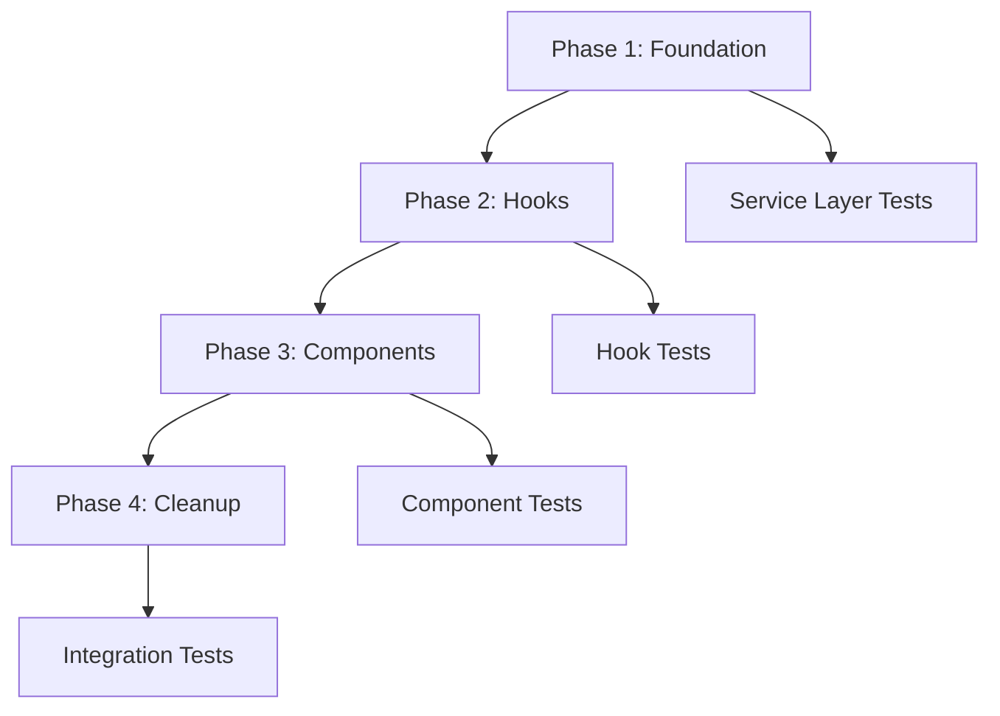

# Migration Plan

This is the detailed migration plan for the spec detailed in @.agent-os/specs/2025-09-30-price-projection-standardization/spec.md

> Created: 2025-09-30  
> Version: 1.0.0

## Migration Overview

This migration will be executed in **4 phases** over an estimated **2-3 weeks** timeline. Each phase is designed to be independently testable and deployable, minimizing risk while achieving complete standardization.

## Phase 1: Foundation & Service Layer (3-4 days)

### Objective
Refactor core services to use `UnifiedPriceProjectionService` while maintaining backward compatibility.

### Tasks

#### 1.1 Refactor PriceDataService
**File**: `src/modules/price-data/services/PriceDataService.ts`

**Changes**:
```typescript
// Add import
import { unifiedPriceProjectionService, PriceProjectionAdapter } from '@/src/modules/shared'

// Update generatePriceProjection method
async generatePriceProjection(
  params: PriceEngineParams,
  historicalData?: HistoricalDataPoint[]
): Promise<PriceChartDataPoint[]> {
  // Use unified service
  const projection = await unifiedPriceProjectionService.generateProjectionFromLegacyParams(
    params,
    historicalData || []
  )
  
  // Convert to legacy format for backward compatibility
  return PriceProjectionAdapter.toLegacyFormat(projection, historicalData)
}
```

**Estimated Effort**: 2 hours  
**Risk**: Low (maintains backward compatibility)

#### 1.2 Add Deprecation Warnings
**Files**: 
- `src/modules/price-projection/types/index.ts`
- Legacy conversion methods

**Changes**:
```typescript
/**
 * @deprecated Use PriceProjectionResult from app/simulation/price-models/types.ts instead
 * This interface will be removed in v2.0.0
 */
export interface PriceProjectionResult {
  // ... existing code
}
```

**Estimated Effort**: 1 hour  
**Risk**: None (documentation only)

#### 1.3 Update StrategyExecutionService
**File**: `src/modules/strategies/services/StrategyExecutionService.ts`

**Status**: ✅ Already complete (accepts both formats)

#### 1.4 Create Migration Utilities
**File**: `src/modules/shared/utils/migrationHelpers.ts`

**Purpose**: Helper functions for migration

```typescript
export function logFormatUsage(format: 'old' | 'new', location: string) {
  if (process.env.NODE_ENV === 'development') {
    console.warn(`[MIGRATION] Using ${format} format at ${location}`)
  }
}

export function validateMigration(projection: any): boolean {
  return isNewPriceProjectionResult(projection)
}
```

**Estimated Effort**: 1 hour  
**Risk**: None

### Phase 1 Testing
- [ ] Unit tests for refactored `PriceDataService`
- [ ] Integration tests for service layer
- [ ] Verify backward compatibility
- [ ] Check deprecation warnings appear

**Phase 1 Total Effort**: 3-4 days  
**Phase 1 Risk Level**: Low

---

## Phase 2: Hook Migration (4-5 days)

### Objective
Update all hooks to use `UnifiedPriceProjectionService` and return standardized format.

### Tasks

#### 2.1 Migrate usePriceProjection
**File**: `src/modules/price-data/hooks/usePriceProjection.ts`

**Changes**:
```typescript
import { unifiedPriceProjectionService, type PriceProjectionResult } from '@/src/modules/shared'

// Update return type
interface UsePriceProjectionReturn {
  projectionData: PriceProjectionResult | null  // Changed from PriceChartDataPoint[]
  // ... rest
}

// Update generateProjection
const generateProjection = useCallback(async (params: PriceEngineParams) => {
  const projection = await unifiedPriceProjectionService.generateProjectionFromLegacyParams(
    params,
    options.historicalData || []
  )
  setProjectionData(projection)  // Store standard format
}, [options.historicalData])
```

**Estimated Effort**: 3 hours  
**Risk**: Medium (affects multiple consumers)

#### 2.2 Migrate usePriceGeneration
**File**: `app/simulation/hooks/usePriceGeneration.ts`

**Changes**:
```typescript
// Update to use unified service
const projection = await unifiedPriceProjectionService.generateProjectionFromLegacyParams(
  engineParams,
  historicalPriceData
)

// Convert for context (temporary during migration)
const chartData = PriceProjectionAdapter.toLegacyFormat(projection, historicalPriceData)
setPriceChartData(chartData)
```

**Estimated Effort**: 2 hours  
**Risk**: Medium (used in main simulation flow)

#### 2.3 Migrate usePriceData
**File**: `src/modules/price-data/hooks/usePriceData.ts`

**Changes**: Similar pattern to `usePriceProjection`

**Estimated Effort**: 2 hours  
**Risk**: Low

#### 2.4 Update useMultiModelProjection
**File**: `src/modules/price-data/hooks/usePriceProjection.ts`

**Changes**:
```typescript
// Update to store PriceProjectionResult instead of PriceChartDataPoint[]
const [projections, setProjections] = useState<Map<PriceModel, PriceProjectionResult>>(new Map())
```

**Estimated Effort**: 2 hours  
**Risk**: Low

### Phase 2 Testing
- [ ] Unit tests for each migrated hook
- [ ] Integration tests for hook consumers
- [ ] Verify data flow through components
- [ ] Check performance (no regression)

**Phase 2 Total Effort**: 4-5 days  
**Phase 2 Risk Level**: Medium

---

## Phase 3: Component Migration (5-6 days)

### Objective
Update all components to accept and use `PriceProjectionResult` directly.

### Tasks

#### 3.1 Update SimulationContext
**File**: `app/simulation/context/SimulationContext.tsx`

**Changes**:
```typescript
interface SimulationContextType {
  // Change from PriceChartDataPoint[] to PriceProjectionResult
  priceProjection: PriceProjectionResult | null
  setPriceProjection: (projection: PriceProjectionResult | null) => void
  
  // Keep legacy for backward compatibility (temporary)
  priceChartData: PriceChartDataPoint[]
  setPriceChartData: (data: PriceChartDataPoint[]) => void
}
```

**Estimated Effort**: 3 hours  
**Risk**: High (affects entire app)

#### 3.2 Migrate Price Projection Tab Components
**Files**:
- `app/simulation/tabs/price-projection/UnifiedPriceChart.tsx`
- `app/simulation/tabs/price-projection/PriceProjectionChart.tsx`
- `app/simulation/tabs/price-projection/GrowthRateAnalysis.tsx`

**Pattern**:
```typescript
interface Props {
  projection: PriceProjectionResult  // Changed from chartData
}

// Inside component
const chartData = useMemo(() => 
  PriceProjectionAdapter.toLegacyFormat(projection),
  [projection]
)
```

**Estimated Effort**: 6 hours  
**Risk**: Medium

#### 3.3 Migrate Strategy Tab Components
**Files**:
- Strategy execution components
- Strategy visualization components

**Changes**: Use `PriceProjectionAdapter.toStrategyFormat()` for conversion

**Estimated Effort**: 4 hours  
**Risk**: Medium

#### 3.4 Migrate Results Tab Components
**Files**:
- `app/simulation/tabs/results/charts/BitcoinPriceChart.tsx`
- Other results visualization components

**Changes**: Use `PriceProjectionAdapter.toResultsFormat()` for conversion

**Estimated Effort**: 4 hours  
**Risk**: Medium

### Phase 3 Testing
- [ ] Visual regression testing for all charts
- [ ] Functional testing for each tab
- [ ] Cross-tab data flow testing
- [ ] User acceptance testing

**Phase 3 Total Effort**: 5-6 days  
**Phase 3 Risk Level**: High

---

## Phase 4: Cleanup & Removal (2-3 days)

### Objective
Remove all legacy code, duplicate types, and conversion layers.

### Tasks

#### 4.1 Remove Old Type Definitions
**Files to Delete**:
- `src/modules/price-projection/types/index.ts`
- Duplicate types in `src/modules/parameters/types/`
- Duplicate types in `src/modules/results/types/`

**Estimated Effort**: 2 hours  
**Risk**: Low (after migration complete)

#### 4.2 Remove Legacy Conversion Code
**Changes**:
- Remove `toLegacyFormat()` from `PriceProjectionAdapter`
- Remove `fromOldFormat()` from `PriceProjectionAdapter`
- Remove legacy support from `UnifiedPriceProjectionService`

**Estimated Effort**: 2 hours  
**Risk**: Low

#### 4.3 Remove Deprecated Services
**Evaluate**:
- Can `src/modules/price-projection/` be deleted entirely?
- Remove legacy methods from `PriceDataService`

**Estimated Effort**: 3 hours  
**Risk**: Medium

#### 4.4 Update All Imports
**Tool**: Use IDE refactoring tools

**Pattern**:
```typescript
// Before
import type { PriceProjectionResult } from '@/src/modules/price-projection/types'

// After
import type { PriceProjectionResult } from '@/app/simulation/price-models/types'
```

**Estimated Effort**: 2 hours  
**Risk**: Low

#### 4.5 Remove Legacy Context Fields
**File**: `app/simulation/context/SimulationContext.tsx`

**Remove**:
```typescript
// Remove these after all consumers migrated
priceChartData: PriceChartDataPoint[]
setPriceChartData: (data: PriceChartDataPoint[]) => void
```

**Estimated Effort**: 1 hour  
**Risk**: Low

### Phase 4 Testing
- [ ] Full regression test suite
- [ ] Type checking (zero errors)
- [ ] Build verification
- [ ] Bundle size analysis
- [ ] Performance benchmarking

**Phase 4 Total Effort**: 2-3 days  
**Phase 4 Risk Level**: Low

---

## Timeline Summary

| Phase | Duration | Risk | Dependencies |
|-------|----------|------|--------------|
| Phase 1: Foundation | 3-4 days | Low | None |
| Phase 2: Hooks | 4-5 days | Medium | Phase 1 |
| Phase 3: Components | 5-6 days | High | Phase 2 |
| Phase 4: Cleanup | 2-3 days | Low | Phase 3 |
| **Total** | **14-18 days** | | |

**Estimated Calendar Time**: 2-3 weeks (accounting for testing and reviews)

## Risk Assessment by Phase

### Phase 1: Low Risk ✅
- Maintains backward compatibility
- Service layer changes only
- Easy to test in isolation
- Easy to roll back

### Phase 2: Medium Risk ⚠️
- Affects data flow
- Multiple hook consumers
- Requires careful testing
- Moderate rollback complexity

### Phase 3: High Risk 🔴
- User-facing changes
- Complex component interactions
- Requires extensive testing
- Difficult to roll back

### Phase 4: Low Risk ✅
- Cleanup only
- No functional changes
- Easy to verify
- Easy to roll back

## Rollback Strategy

### Phase 1-2 Rollback
- Revert service changes
- Remove new imports
- Restore old method implementations
- **Effort**: 1-2 hours

### Phase 3 Rollback
- Revert component changes
- Restore context changes
- Re-enable legacy data flow
- **Effort**: 4-6 hours

### Phase 4 Rollback
- Restore deleted files from git
- Re-add removed methods
- **Effort**: 1-2 hours

## Success Metrics

### Code Metrics
- [ ] ~500 lines removed
- [ ] Zero duplicate type definitions
- [ ] Single `PriceProjectionResult` location
- [ ] Zero TypeScript errors
- [ ] Bundle size reduced by ~5-10%

### Quality Metrics
- [ ] 100% test pass rate
- [ ] Zero console warnings
- [ ] No performance regression
- [ ] All visual regression tests pass

### Process Metrics
- [ ] Each phase independently deployable
- [ ] Each phase fully tested
- [ ] Documentation updated per phase
- [ ] Team review completed per phase

## Dependencies Between Phases



## Architecture Diagrams

### Before Migration (Current State)

```
┌─────────────────────────────────────────────────────────────┐
│                     THREE INCOMPATIBLE FORMATS               │
├─────────────────────────────────────────────────────────────┤
│                                                              │
│  Format 1: app/simulation/price-models/types.ts             │
│  ┌────────────────────────────────────────────┐             │
│  │ PriceProjectionResult {                    │             │
│  │   modelName, projectionPoints[], metadata  │             │
│  │ }                                           │             │
│  └────────────────────────────────────────────┘             │
│  Used by: Enhanced Cycle Repeat Model                       │
│                                                              │
│  Format 2: src/modules/price-projection/types/              │
│  ┌────────────────────────────────────────────┐             │
│  │ PriceProjectionResult {                    │             │
│  │   projectedPrices[], projectionPoints[],   │             │
│  │   metadata                                  │             │
│  │ }                                           │             │
│  └────────────────────────────────────────────┘             │
│  Used by: StrategyExecutionService                          │
│                                                              │
│  Format 3: src/modules/price-data/types/                    │
│  ┌────────────────────────────────────────────┐             │
│  │ PriceChartDataPoint[] {                    │             │
│  │   date, days, historicalPrice,             │             │
│  │   simulationPath, support, resistance      │             │
│  │ }                                           │             │
│  └────────────────────────────────────────────┘             │
│  Used by: PriceDataService, Charts                          │
│                                                              │
│  Problem: ~500 lines of adapter code needed!                │
└─────────────────────────────────────────────────────────────┘
```

### After Migration (Target State)

```
┌─────────────────────────────────────────────────────────────┐
│                    SINGLE STANDARD FORMAT                    │
├─────────────────────────────────────────────────────────────┤
│                                                              │
│  app/simulation/price-models/types.ts (ONLY SOURCE)         │
│  ┌────────────────────────────────────────────┐             │
│  │ PriceProjectionResult {                    │             │
│  │   modelName: string                        │             │
│  │   modelVersion: string                     │             │
│  │   projectionPoints: ProjectionPoint[]      │             │
│  │   metadata: {                               │             │
│  │     totalMonths, totalGrowth,              │             │
│  │     averageMonthlyGrowth, maxDecline,      │             │
│  │     volatility, confidence, generatedAt    │             │
│  │   }                                         │             │
│  │ }                                           │             │
│  └────────────────────────────────────────────┘             │
│                                                              │
│  Used by: ALL price projection models                       │
│           ALL hooks                                          │
│           ALL components                                     │
│           ALL services                                       │
│                                                              │
│  Adapters (for specialized needs only):                     │
│  ┌────────────────────────────────────────────┐             │
│  │ PriceProjectionAdapter                     │             │
│  │ - toStrategyFormat()                       │             │
│  │ - toResultsFormat()                        │             │
│  │ - getPriceAtMonth()                        │             │
│  └────────────────────────────────────────────┘             │
│                                                              │
│  Benefits: Zero conversion code, single source of truth!    │
└─────────────────────────────────────────────────────────────┘
```

### Data Flow After Migration

```
┌──────────────┐
│  Parameters  │
│     Tab      │
└──────┬───────┘
       │ PriceModelParams
       ▼
┌──────────────────────────┐
│ UnifiedPriceProjection   │
│       Service            │
└──────┬───────────────────┘
       │ PriceProjectionResult (standard)
       ▼
┌──────────────────────────┐
│  SimulationContext       │
│  (stores standard format)│
└──────┬───────────────────┘
       │
       ├─────────────────────────────────┐
       │                                 │
       ▼                                 ▼
┌──────────────┐                  ┌──────────────┐
│  Strategies  │                  │   Results    │
│     Tab      │                  │     Tab      │
└──────┬───────┘                  └──────┬───────┘
       │                                 │
       │ PriceProjectionAdapter          │ PriceProjectionAdapter
       │ .toStrategyFormat()             │ .toResultsFormat()
       ▼                                 ▼
┌──────────────┐                  ┌──────────────┐
│ Strategy     │                  │  Results     │
│ Execution    │                  │  Charts      │
└──────────────┘                  └──────────────┘
```

## Communication Plan

### Phase Start
- Announce phase start in team chat
- Share phase objectives and timeline
- Identify phase reviewers

### Phase End
- Demo phase changes
- Review test results
- Get approval before next phase
- Update documentation

### Issues
- Report blockers immediately
- Escalate risks to team lead
- Document workarounds
- Update timeline if needed

